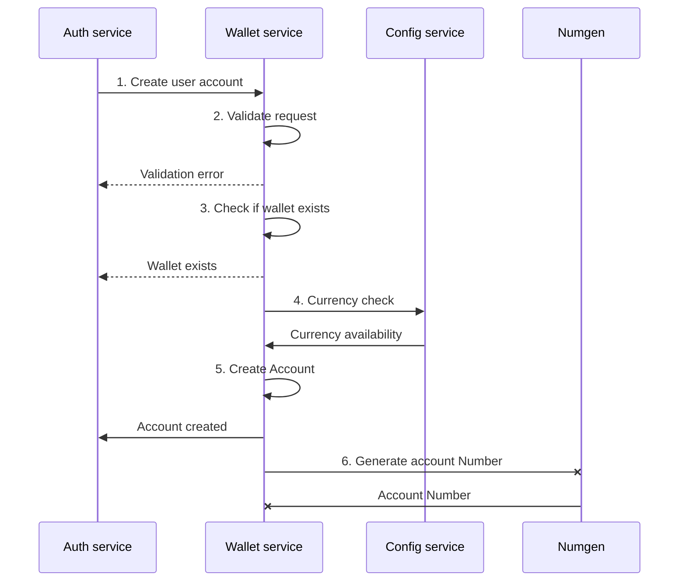

### 1. Account creation

This is the process of creating Tospay user acounts. The following microservices: ([Auth service](), [Config service](https://xanda.tospay.net/microservices-node/aror-config-service) and [Number generator]()) are required to complete this process. This process goes through the following steps:
1. Authentication service initiates the creation process.
2. Wallet service validates the request and responds with an error if validation fails
3. Wallet service checks if the account to be created already exists and responds with an error if the wallet exists
4. Wallet service sends the account currency to Config service, Config service looks up the currency and responds to Wallet service, If the currency does not exist it defaults to USD as a currency.
5. Wallet service then creats an acount and responds with a success message.
6. Wallet service asynchronously sends a request to Number generation service which generates an account number then its is updated to the Account model

This pocess is illustrated in the sequence diagram below:



Code sample for this process:
```javascript
{
    "URL": "api/v1/account/create",
    "METHOD": "GET",
    "HEADERS": {
    },
    "REQUEST": {
        "user_id": "ba60aa1d-476f-43c6-947f-0a17ad88234c",
        "user_type": "PERSONAL",
        "account_no": "KE133313131",
        "currency": "KES"
    },
    "RESPONSE": {
        "SUCCESS": {
            "status": "000",
            "description": 'Wallet created',
            "data": {}
        },
        "ERROR": {
            "SAMPLE": {
                "status": '001',
                "description": 'Invalid credentials',
                "error": []
            },
            "CODES": [
                { "status": "001", "description": "Invalid credentials"  },
                { "status": "001", "description": "Wallet already exists"  }
            ]
        }
    }
}
```
